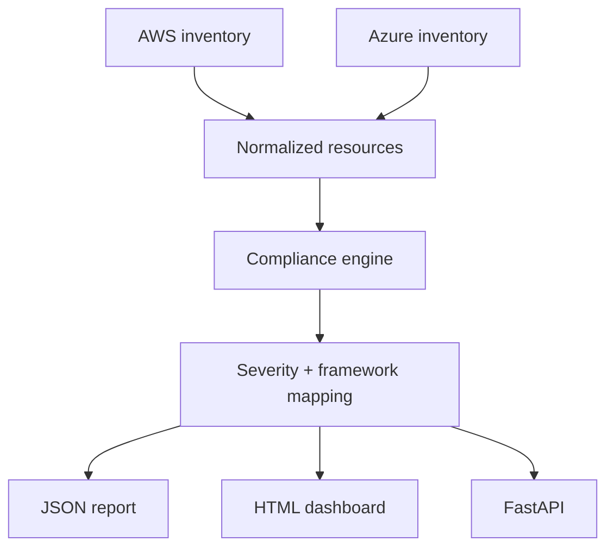

# Multi-Cloud Security Compliance Scanner

A defensive security portfolio project that assesses AWS and Microsoft Azure resource inventories, ranks findings by severity, maps controls to common frameworks, and produces actionable JSON and HTML reports.

> This scanner is read-only by design. It identifies configuration risk but never changes cloud resources.

## Business problem

Cloud estates accumulate insecure configurations such as public storage, weak encryption, excessive network exposure, missing audit logs, and disabled identity protections. Security teams need consistent evidence and prioritized remediation across multiple providers.

## Architecture



## Included controls

| Control | Severity | Framework mapping |
|---|---|---|
| Public object storage prohibited | Critical | CIS, NIST PR.AC |
| Encryption at rest required | High | CIS, NIST PR.DS |
| Management ports restricted | Critical | CIS, NIST PR.AC |
| Multi-factor authentication enabled | High | CIS, NIST PR.AC |
| Audit logging enabled | High | CIS, NIST DE.CM |
| Database public access prohibited | Critical | CIS, NIST PR.AC |
| Backup/retention enabled | Medium | NIST PR.IP |
| Resource ownership tags present | Low | Governance |

Framework references are directional mappings for demonstration, not a formal certification or audit opinion.

## Quick start

```bash
python -m venv .venv
source .venv/bin/activate  # Windows: .venv\\Scripts\\activate
pip install -r requirements.txt
python -m scanner.cli --input samples/aws_inventory.json --output reports/aws
python -m scanner.cli --input samples/azure_inventory.json --output reports/azure
uvicorn scanner.api:app --reload
```

Open `reports/aws/report.html` for the visual dashboard or <http://localhost:8000/docs> for the API.

## API

| Endpoint | Purpose |
|---|---|
| `GET /health` | Service readiness |
| `POST /scan` | Assess a normalized resource inventory |

## Safe live-cloud extension

The project includes read-only adapter interfaces for AWS and Azure. Production integration should use short-lived workload identity and the least-privilege permissions needed to describe resources. Never store access keys in the repository.

## Exit codes

- `0`: scan completed without critical findings
- `2`: one or more critical findings detected

This enables security gates in CI/CD without automatically remediating production infrastructure.

## Interview talking points

1. Why normalized controls improve consistency across cloud providers.
2. Why findings need evidence, severity, framework mapping, and remediation.
3. How least privilege and read-only collection reduce scanner risk.
4. How exceptions, compensating controls, and false positives should be governed.
5. How to integrate results with Security Hub, Defender for Cloud, SIEM, and ticketing.

## License

MIT
